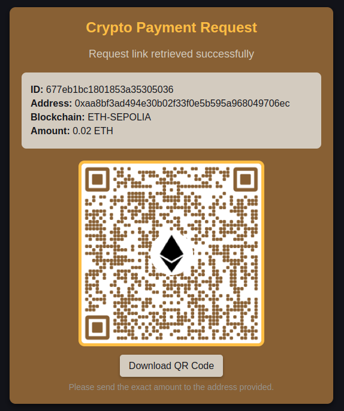
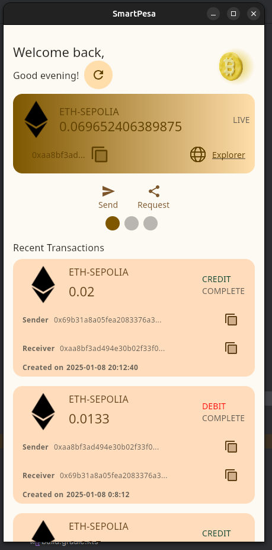

# Multiplatform Crypto Wallet (SmartPesa)


## Overview
**SmartPesa** is an innovative, Kotlin Multiplatform (KMP)-based open-source project designed to revolutionize cryptocurrency wallet management across multiple platforms. By leveraging advanced KMP technology, SmartPesa ensures a seamless and secure experience for users, enabling effortless transactions by simply scanning a QR code.

### Key Features
- **Error-Free Transactions**: Avoid wallet address errors with QR code-based transactions.
- **Enhanced Security**: Mitigate wallet poisoning attacks in crypto markets.
- **User-Friendly**: Designed for both crypto newcomers and seasoned users.
- **Financial Inclusion**: Focused on empowering unbanked and underbanked populations, particularly in Sub-Saharan Africa.

### Crypto Transafer demo
[](https://www.youtube.com/watch?v=hjJZPTOf_6k)

### Crypto payment request


### Components
SmartPesa comprises:
1. A **Ktor-based server** integrating with **Circle.io** for:
    - Programmable wallets
    - Transaction processing
    - Wallet management
2. A **Kotlin Multiplatform Android application** for seamless mobile wallet management.
3. A **desktop application** offering extended functionality and accessibility.

---

## Ktor Server Setup

### Local Environment Setup
To configure the Ktor server locally:

1. Create a `.env` file in the root directory of the server module and add the following configurations:

```env
# Circle Programmable Wallets Configuration
API_KEY=TEST_API_KEY             # Replace with Circle's test API key
ENTITY_SECRETE=circle_entity_secret

# JWT Configuration
JWT_SECRETE=your_own_jwt_secret

# MongoDB Configuration
MONGODBUSERNAME=your_mongodb_username
MONGODBPASSWORD=your_mongodb_password
DATABASENAME=your_mongodb_database_name
```
2. Add the .env file variables to your development environment (e.g., IntelliJ IDEA or Android Studio).
3. Run the server application. The server will start on port 8081.
4. Create mongodb database from mongodb atlas for free and quick setup or modify the database url build to work with your local mongodb.

## Docker Setup
You can also deploy the server using Docker for faster and more consistent setup.

Docker Compose File
Create a docker-compose.yml file with the following content:
```yaml
version: '3.8'

services:
  smartpesa:
    image: pascarl/smartpesa:latest
    container_name: smartpesa-app
    ports:
      - "8080:8081"
    env_file:
      - .env
    restart: unless-stopped
    networks:
      - smartpesa-network
    volumes:
      - ./app_data:/app_data

networks:
  smartpesa-network:
    driver: bridge

```
## Live Test
To test the server, a live deployment has been made on an AWS EC2 instance for free testing.
You can access the server using the following base URL

Base URL: http://52.57.41.193

You can also get the api documentation [here](https://documenter.getpostman.com/view/27366427/2sAYJ7hKUB)

## CI/CD 
To save time managing deployments i wanted to automate that part so with docker, 
docker hub and github actions i was able to automate that part. This saved me lots 
of time a nd helped me reduce deployments errors and bugs.
How ever i faced challenge when i tried to use ktor in build docker plugin. for some 
reason i was anable to use the docker plugin to build and genrate the docker images. but the funny thing is 
i only experience this problem withing kmp project but as ktor stand alone everything was working well 
so i revolted to building my own dockerfile which you can find it at the root of the project.

I tweeted the issue on x maybet @jetbrains team might follow it up. here is the [tweet](https://x.com/pasaka254/status/1867994507658379280)

Then the github workflows are in the .github directory in the root folder. you will find build-image.yml
for building the docker image and publishing it to dockerhub, and deploy-to-ec2.yml for deploying the image
to aws ec2 instance. make sure you server is configured with docker and docker-compose.

Here’s how to run your Kotlin Multiplatform (KMP) project using Android Studio:

---

## Desktop Setup (Linux)

1. **Open the Project in Android Studio**:
   - Launch Android Studio and open the root folder of your KMP project.

2. **Select the Desktop Target**:
   - In the **Run/Debug Configurations** dropdown at the top-right corner of Android Studio, select the `desktopApp` configuration. If it’s not listed:
      - Go to **Run > Edit Configurations**.
      - Click the "+" button, select **Gradle**, and choose the `:desktopApp:run` task.

3. **Run the Desktop App**:
   - Click the green **Run** button or press `Shift + F10`.
   - The app will launch as a standalone desktop application.

Or alternetivley run this gradlew command
```shell
./gradlew desktopRun -DmainClass=org.example.project.MainKt --quiet
```
---

## Android Setup (Emulator/Physical Device)

1. **Setup Android Studio**:
   - Make sure you have the **Android SDK** installed via Android Studio.
   - If you’re targeting an emulator:
      - Go to **Device Manager** in Android Studio and create a new emulator.
      - Start the emulator from the Device Manager.

2. **Connect an Android Device (Optional)**:
   - If using a physical device:
      - Enable **Developer Mode** and **USB Debugging** on the device.
      - Connect it via USB and verify it’s recognized:
        ```bash
        adb devices
        ```

3. **Open the Project in Android Studio**:
   - Open the same root folder of your KMP project in Android Studio.

4. **Select the Android Target**:
   - In the **Run/Debug Configurations** dropdown, select the `androidApp` configuration. If it’s missing:
      - Go to **Run > Edit Configurations**.
      - Click the "+" button, select **Gradle**, and choose the `:androidApp:assembleDebug` or `:androidApp:installDebug` task.

5. **Run the Android App**:
   - Click the green **Run** button or press `Shift + F10`.
   - Select your target device (emulator or physical device) in the device picker dialog.
   - The app will build and launch on the selected device.

---

## Screenshots

### Desktop



### Android


### Testing Wallets

To facilitate wallet testing, the following wallets and their recovery codes are available just import the wallets:

- **Wallet 1**
   - **Recovery Code**: `f0902bf9-8747-4b01-b928-5759590e3baa`

- **Wallet 2**
   - **Recovery Code**: `774eef0d-7192-4664-b824-5e19f376bcdd`

If you prefer to test with a new wallet, you can request test tokens from the official [Google Faucet](https://cloud.google.com/application/web3/faucet).

## Architecture

The system is built using a client-server architecture, leveraging **Ktor Server** as a lightweight and asynchronous web server. Communication between the client and server is handled via REST APIs using **Ktor Client**. The server integrates with **MongoDB Atlas Cloud** for database storage and sits behind the **Circle.com programmable wallets API**, which manages authentication and regulates API interactions. The server handles key functionalities such as wallet creation, management, transactions, and the generation of crypto payment requests with QR codes.

### Server-Side Technologies
- **Database**: MongoDB Atlas for scalable and secure cloud-based storage.
- **Programmable Wallets**: Circle.com API for secure and authenticated wallet management.
- **Dependency Injection**: Koin is used for a clean, modular, and testable server architecture.

### Client-Side Applications
The system includes both an Android app and a desktop application, providing a seamless and visually appealing interface for interacting with the server. The client applications are designed with the following features:

- **Networking**: Powered by **Ktor Client** for efficient API communication.
- **Key-Value Storage**: Utilized **Datastore Preferences** for persistent storage in a Kotlin Multiplatform Project (KMP) environment.
- **Navigation**: Implemented type-safe **Compose Navigation** for an intuitive and predictable user experience.
- **UI Design**: Built using **Material 3** for a modern and cohesive user interface.

### Key Features
- **Dynamic QR Code Generation**: QR codes are dynamically updated as values change, ensuring faster and more flexible transactions.
- **QR Code Scanning**: Integrated Android camera functionality for quick QR code scanning.
- **WebView Integration**: Enables users to view their transactions directly on blockchain explorers.
- **Clipboard Functionality**: Simplifies address sharing and reduces typing errors with a copy-to-clipboard feature.
- **Dynamic Color Theme**: UI colors dynamically adjust based on images, creating a visually harmonious experience.
- **Screen Optimization**: The app is designed to minimize the number of screens, improving usability, speed, and memorability.

### Design and Architecture
The client applications are built using the **MVVM (Model-View-ViewModel)** pattern, following clean architecture principles to ensure maintainability and scalability.

---

```text
Copyright (c) 2024 Pasaka Mutuku, Smart Pesa  

Permission is hereby granted, free of charge, to any person obtaining a copy  
of this software and associated documentation files (the "Software"), to deal  
in the Software without restriction, including without limitation the rights  
to use, copy, modify, merge, publish, distribute, sublicense, and/or sell  
copies of the Software, and to permit persons to whom the Software is  
furnished to do so, subject to the following conditions:  

The above copyright notice and this permission notice shall be included in all  
copies or substantial portions of the Software.  

THE SOFTWARE IS PROVIDED "AS IS", WITHOUT WARRANTY OF ANY KIND, EXPRESS OR  
IMPLIED, INCLUDING BUT NOT LIMITED TO THE WARRANTIES OF MERCHANTABILITY,  
FITNESS FOR A PARTICULAR PURPOSE AND NONINFRINGEMENT. IN NO EVENT SHALL THE  
AUTHORS OR COPYRIGHT HOLDERS BE LIABLE FOR ANY CLAIM, DAMAGES OR OTHER  
LIABILITY, WHETHER IN AN ACTION OF CONTRACT, TORT OR OTHERWISE, ARISING FROM,  
OUT OF OR IN CONNECTION WITH THE SOFTWARE OR THE USE OR OTHER DEALINGS IN THE  
SOFTWARE.  

```

